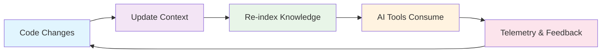
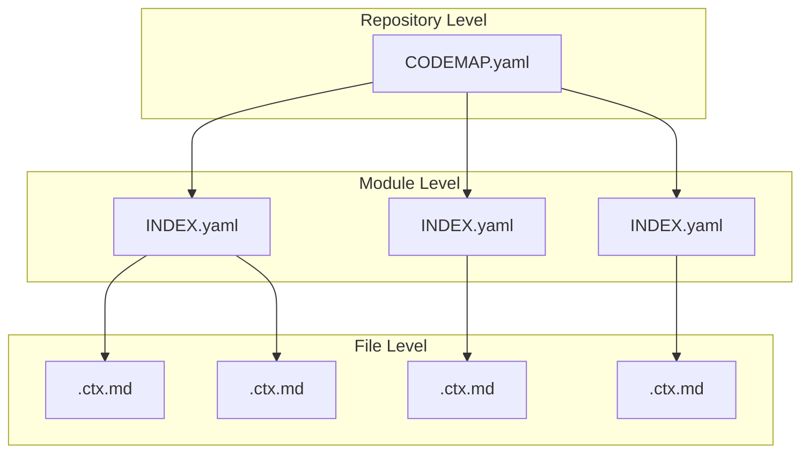

# CCD for AI (Continuous Context Documentation for AI)

## Transform Software Documentation with AI-Native Context

CCD is a methodology that operationalizes RAG (Retrieval-Augmented Generation) for software development by creating a continuous feedback loop between code changes and context documentation.

[Get Started](../docs/01-overview.md){ .md-button .md-button--primary }
[View on GitHub](https://github.com/yegorferrieres/ccd-ai){ .md-button }

## What is CCD?

CCD transforms static, outdated documentation into living, AI-consumable context that automatically stays fresh with code changes. It provides a four-tier architecture for maintaining comprehensive project context:

- **Repository Level**: High-level project overview and module mapping
- **Module Level**: Service-specific purpose, I/O contracts, and file relationships  
- **File Level**: Detailed file documentation with structured metadata
- **Code Level**: Direct context access through AI-CONTEXT comments in source code

## Key Benefits

### For Development Teams
- **Eliminate Documentation Debt**: Automatic updates prevent stale documentation
- **Improve Onboarding**: New team members understand codebase faster
- **Enable Knowledge Transfer**: Context survives team changes
- **Scale with Projects**: From startups to enterprise organizations

### For AI Tools
- **Structured Context**: Optimized for RAG system consumption
- **Real-time Updates**: Always current with latest code changes
- **Comprehensive Coverage**: Complete project context in one place
- **Performance Optimized**: Fast retrieval and processing

### For DevOps Engineers
- **Automated Validation**: CI/CD integration ensures quality
- **Health Monitoring**: Track documentation health and coverage
- **Quality Gates**: Enforce documentation standards automatically
- **Performance Metrics**: Measure and optimize context effectiveness

### For AI Tools
- **Direct Code Access**: Context available immediately from source code
- **Real-time Status**: Current context freshness and health indicators
- **Structured Integration**: Parsable format for automated processing
- **Context Awareness**: Always know current project state

## How It Works



1. **Code Changes**: Developers make changes to the codebase
2. **Update Context**: Context files are automatically updated
3. **Re-index Knowledge**: Vector embeddings are regenerated
4. **AI Tools Consume**: AI tools access latest context
5. **Telemetry & Feedback**: Usage metrics inform improvements

## Quick Start

### 1. Install CCD CLI
```bash
npm install -g @ccd/cli
```

### 2. Initialize Project
```bash
ccd init --project-name "Your Project" --domain "web-application"
```

### 3. Generate Context
```bash
ccd generate-cards --files "src/**/*.{js,ts,py,go}" --output docs/context-cards/
```

### 4. Validate Context
```bash
ccd validate-contexts --contexts docs/ --schemas docs/schemas/
```

### 5. Add AI-CONTEXT Comments
```bash
# Add context comments to source files
ccd add-context-comments --file "src/main.go" --context "docs/contexts/files/src/main.go.ctx.md"

# Validate comment format
ccd validate-context-comments --file "src/main.go"
```

## Success Metrics

- **Context Freshness**: ≤24h after merge
- **Retrieval Precision@K**: ≥85%
- **Context Coverage**: ≥90% of modules mapped
- **Drift MTTR**: ≤4h
- **Time-to-Context (TTC)**: ≤30min

## Architecture Overview



## Technology Stack

- **CLI**: Node.js + TypeScript
- **Validation**: JSON Schema
- **CI/CD**: GitHub Actions, GitLab CI
- **Documentation**: MkDocs + Material
- **Context Storage**: Git-based with optional vector storage

## Community & Support

- **GitHub**: [yegorferrieres/ccd](https://github.com/yegorferrieres/ccd-ai)
- **Discussions**: [GitHub Discussions](https://github.com/yegorferrieres/ccd-ai/discussions)
- **Issues**: [GitHub Issues](https://github.com/yegorferrieres/ccd-ai/issues)
- **Documentation**: [Full Documentation](../docs/README.md)

## Getting Help

- **Documentation**: Start with the [Overview](../docs/01-overview.md)
- **Examples**: See [MartLive implementation](../docs/examples/martlive/)
- **Playbooks**: Follow [implementation guides](../docs/playbooks/)
- **Community**: Join discussions and ask questions

---

**Status**: Active Development  
**Version**: 1.0.0-alpha  
**License**: MIT  
**Last Updated**: 2025-08-28
